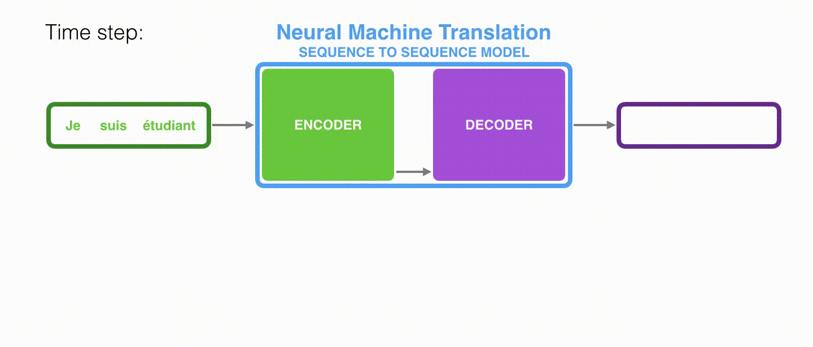
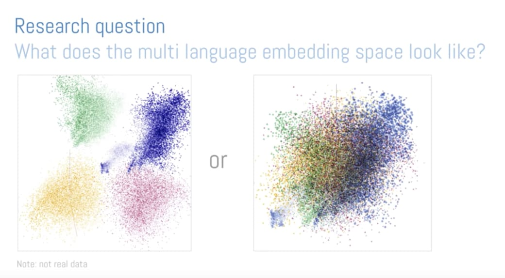

# Seq2Seq 模型的運作原理 (**Encoder-Decoder 模型**)

 

---

 

## 神經機器翻譯：Encoder-Decoder 模型

**神經機器翻譯 NMT 即代表使用類神經網路（Neural Network）來做機器翻譯**

深度學習時代，一般會使用以 **RNN (循環神經網路, Recurrent Neural Network)** 為基礎的 Encoder-Decoder 架構（又被稱作 Seq2Seq 模型）來做序列生成：

一個自然語言的句子基本上可以被視為一個**有時間順序的序列數據（Sequence Data）**，給定一個向量序列，RNN 就是回傳一個一樣長度的向量序列作為輸出。

 

一個以 RNN 為基礎的 Encoder-Decoder / Seq2Seq 模型將法文翻譯成英文的步驟:

* Seq2Seq 模型的 **Encoder** 跟 **Decoder** 是各自獨立的 RNN。
* Encoder 把輸入的句子做處理後所得到的最終 **Hidden State#3** 並交給 Decoder 來生成目標語言。

> Hidden State#3 就是一個抽象的語意概念

 

#### 原理解釋

兩個語義相同的法英句子雖然使用的語言、語順不一樣，**但因為它們有相同的語義**。所以：

* Encoder 在將整個法文句子濃縮成一個嵌入空間（Embedding Space）中的向量

* Decoder 能利用隱含在該向量中的語義資訊來重新生成具有相同意涵的英文句子

#### 白話文解釋

Seq2Seq 模型就像是在模擬人類做翻譯的兩個主要過程：

* Encoder: **解譯來源文字的文意**
* Decoder: **重新編譯該文意至目標語言**

 

---

 

如果我們利用 Seq2Seq 模型將多種語言的句子都轉換到某個嵌入空間裡頭，該空間會長成什麼樣子呢？

* 左邊：代表神經網路並沒有創出一個 "語義" 空間，而只是把不同語言都投射到該嵌入空間裡的不同位置。

* 右邊：無關語言，只要句子的語義接近，彼此的距離就相近的語義空間。

 
 

**只要對自然語言做正確的轉換，就能將語言相異但同語義的句子都轉換成彼此距離相近的語義向量，並以此做出好的翻譯。**

 
 

---

 
 

[back](README.md) | [next](1-2.md)