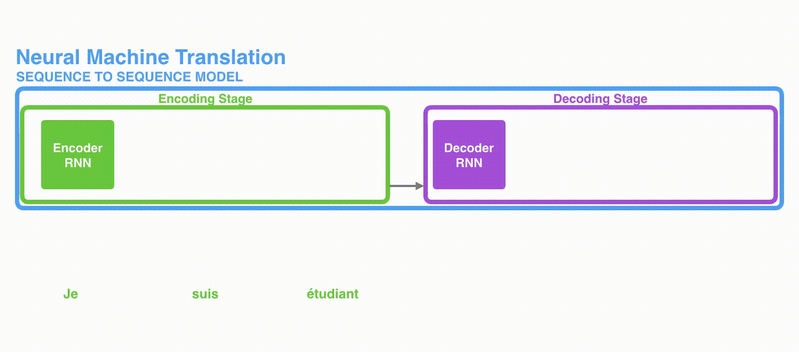
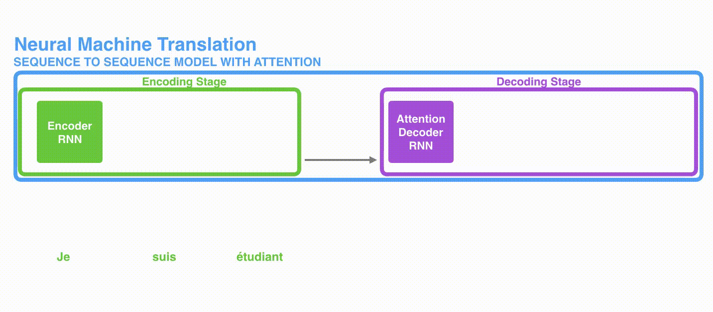
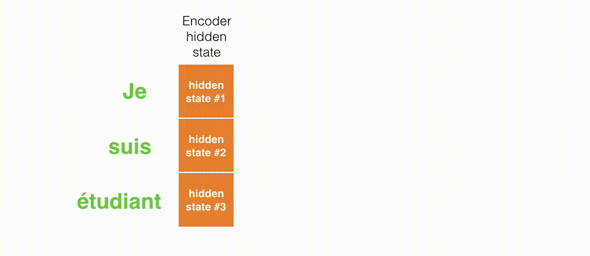
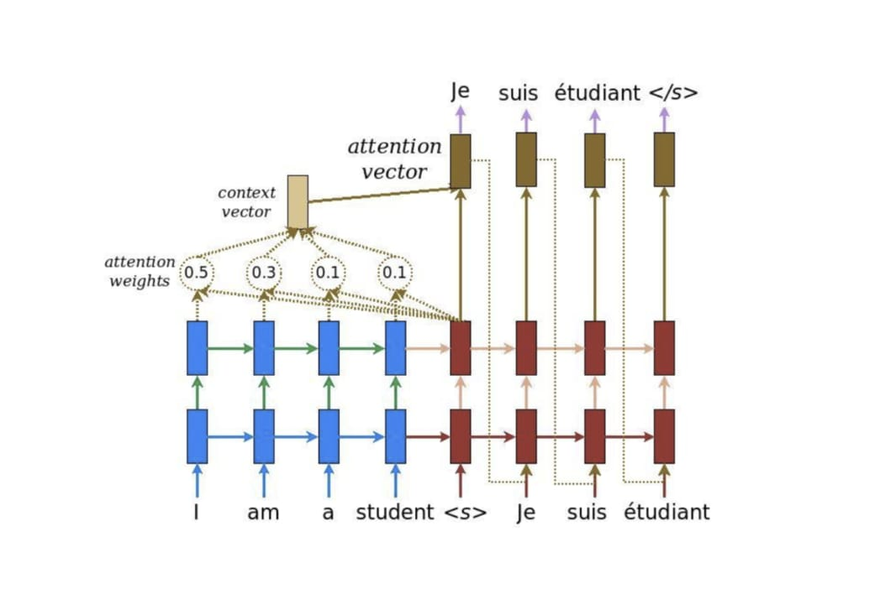
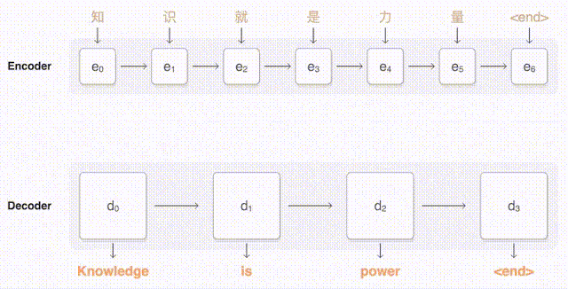

# 注意力機制的概念與計算過程 (**Seq2Seq 模型 + 注意力機制**)

 

---

 

把用 RNN 實作的 Encoder / Decoder 在每個時間點做的事情從左到右一字排開：

上圖的輸入句子只有 3 個詞彙，但如果我們想輸入一個很長的句子呢？

 

## 優化 Seq2Seq

### 遇到的問題

Seq2Seq 模型裡的一個重要假設是:

* Encoder: 把輸入句子的語義全都壓縮成一個固定維度的語義向量。
* Decoder: 只要利用該向量裡頭的資訊就能重新生成具有相同意義，但不同語言的句子。

**當只有一個向量 (Hidden State #3) 的時候，是不太可能把一個很長的句子的所有資訊打包起來的。**

 

### 解決方法 - 注意力機制（Attention Mechanism）：

**注意力機制（Attention Mechanism）的中心思想**：提供更多資訊給 Decoder，並透過類似資料庫存取的概念，令其自行學會該怎麼提取資訊。

 

"與其只把 Encoder 處理完句子產生的最後「一個」向量交給 Decoder 並要求其從中萃取整句資訊，不如將 Encoder 在處理每個詞彙後所生成的「所有」輸出向量都交給 Decoder，讓 Decoder 自己決定在生成新序列的時候要把「**注意力**」放在 Encoder 的哪些輸出向量上面。"

 

將注意力機制加到 Seq2Seq 模型後的結果：

(注意力機制讓 Decoder 在生成新序列時能查看 Encoder 裡所有可能有用的隱狀態向量 #1, #2, #3)

 

Decoder 在生成新序列的每個元素時都能動態地考慮自己要 **"更注意"** 哪些 Encoder 的向量，因此這種運用注意力機制的 Seq2Seq 架構又被稱作 **動態的條件序列生成（Dynamic Conditional Generation）**。:

(深淺色區分代表每一步生成時的注意力多寡)

 
 

TensorFlow 官方圖示 (英文 -> 法文):

Decoder 在第一個時間點進行的注意力機制，這邊只看 "Je" 生成的瞬間：

 

**注意力機制實際的計算步驟:**

1. 拿 Decoder 當下的紅色隱狀態向量 `ht` 跟 Encoder 所有藍色隱狀態向量 `hs` 做比較，利用 `score()` 函式計算出 `ht` 對每個 `hs` 的注意程度。
   
2. 以此注意程度為權重，加權平均所有 Encoder 隱狀態 `hs` 以取得上下文向量 `context vector`。

3. 將此上下文向量與 Decoder 隱狀態結合成一個注意向量 `attention vector` 並作為該時間的輸出。

4. 該注意向量會作為 Decoder 下個時間點的輸入。

 

**注意程度** 就是 **注意權重**

這些權重值讓當下的 Decoder 清楚**該放多少關注在 Encoder 個別的 Hidden State 身上**，並依此從它們身上取得上下文資訊。

在訓練還沒開始前，這些權重都是隨機且無意義的。透過訓練，神經網路才知道該為這些權重賦予什麼值，**權重就是該神經網路的參數**。

 

---

 

最後一張圖

 
 
 
 

[back](../)