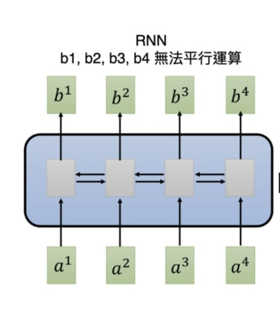
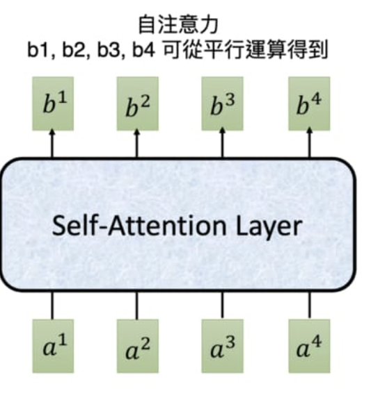

# 自注意力機制與 Transformer 的精神  (**Seq2Seq 模型 + 自注意力機制**)

<br>


---


<br>

## 繼續改善 Seq2Seq 模型 + 注意力機制

循環神經網路 RNN 時常被拿來處理序列數據，但其運作方式存在著一個困擾研究者已久的問題：**無法有效地平行運算。**

以一個有 4 個元素的輸入序列為例：

```
[a1, a2, a3, a4]
```

<br>

要獲得最後一個時間點的輸出向量 b4 得把整個輸入序列跑過一遍才行：



<br>

Google 在 2017 年 6 月的一篇論文：**Attention Is All You Need** 裡參考了注意力機制，提出了 **自注意力機制（Self-Attention mechanism）**。

這個機制不只跟 RNN 一樣可以處理序列數據，還可以平行運算。




一個自注意層（Self-Attention Layer）可以**利用矩陣運算在等同於 RNN 的一個時間點內就回傳所有 `bi`**。且每個 `bi` 都包含了整個輸入序列的資訊。

相比之下，RNN 要經過 4 個時間點依序看過 `[a1, a2, a3, a4]` 以後才能取得序列中最後一個元素 `b4` 。


<br>
<br>

## 自注意力機制 (Transormer 模型) 的基本精神

"在建立序列中每個元素的  representation 時，同時去 "注意" 並擷取同個序列中其他元素的語義。接著將這些語義合併成上下文資訊並當作自己的 representation 回傳"

> representation: 描述某個詞彙、句子意涵的多維實數 Tensor (張量) ps: 可以理解為多維陣列。

<br>

* 注意力機制 - 讓 Decoder 在生成輸出元素的 repr. 時關注 Encoder 的輸出序列，從中獲得上下文資訊

<br>
  
* 自注意力機制 - 讓 Encoder 在生成輸入元素的 repr. 時關注自己序列中的其他元素，從中獲得上下文資訊

* 自注意力機制 - 讓 Decoder 在生成輸出元素的 repr. 時關注自己序列中的其他元素，從中獲得上下文資訊

<br>

在 Transformer 裡，Decoder 利用注意力機制關注 Encoder 的輸出序列（Encoder-Decoder Attention），而 Encoder 跟 Decoder 各自利用自注意力機制關注自己處理的序列（Self-Attention）。無法平行運算的 RNN 完全消失。

<br>

以下則是 Transformer 實際上將英文翻譯成法文的過程：


上面動畫的 `N = 3`，代表著 Encoder 與 Decoder 分別有 3 層。這是一個可調的超參數。

<br>

以 Transformer 實作的 NMT 系統基本上可以分為 6 個步驟：

Encoder: 
1. Encoder 為輸入序列裡的每個詞彙產生初始的 repr. （即詞向量），以空圈表示。
2. 利用自注意力機制將序列中所有詞彙的語義資訊各自匯總成每個詞彙的 repr.，以實圈表示。
3. Encoder 重複 N 次自注意力機制，讓每個詞彙的 repr. 彼此持續修正以完整納入上下文語義。

<br>
Decoder: 

4. Decoder 在生成每個法文字時也運用了自注意力機制，關注自己之前已生成的元素，將其語義也納入之後生成的元素。
5. 在自注意力機制後，Decoder 接著利用注意力機制關注 Encoder 的所有輸出並將其資訊納入當前生成元素的 repr.。
6. Decoder 重複步驟 4, 5 以讓當前元素完整包含整體語義。


<br>
<br>

### Transformer 模型應用的領域

* 文本摘要（Text Summarization）
* 圖像描述（Image Captioning）
* 閱讀理解（Reading Comprehension）
* 語音辨識（Voice Recognition）
* 語言模型（Language Model）
* 聊天機器人（Chat Bot）

<br>
<br>

---

<br>
<br>

[back](README.md)