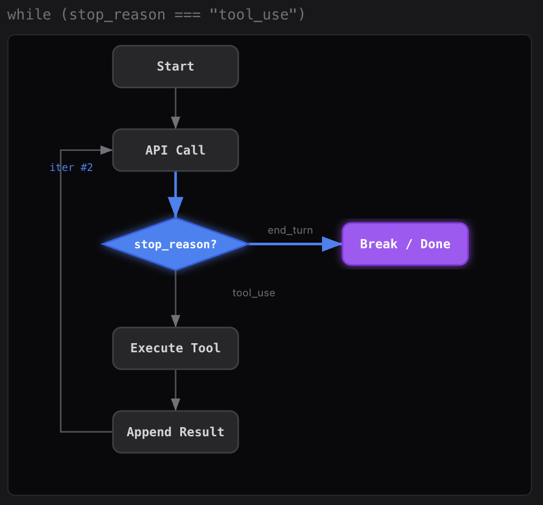
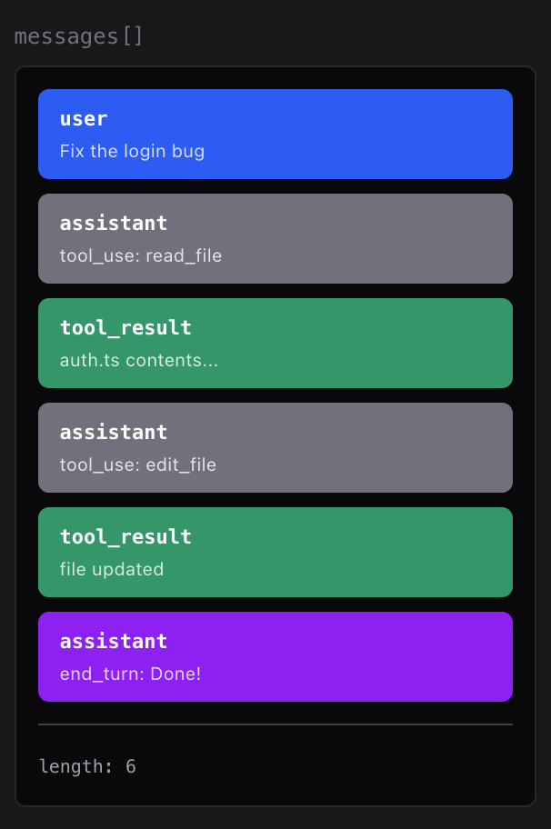

# 基本框架: Agent Loop

<br>

---

<br>

> The minimal agent kernel is a while loop + one tool


## Design




## Source Code

```py
## ========================================================================
# setup
## ========================================================================
client = Anthropic(base_url=os.getenv("ANTHROPIC_BASE_URL"))

MODEL = os.environ["MODEL_ID"]

SYSTEM = f"You are a coding agent at {os.getcwd()}. Use bash to solve tasks. Act, don't explain."

TOOLS = [{
    "name": "bash",
    "description": "Run a shell command.",
    "input_schema": {
        "type": "object",
        "properties": {"command": {"type": "string"}},
        "required": ["command"],
    },
}]

## ========================================================================
# define tools
## ========================================================================

def run_bash(command: str) -> str:
    dangerous = ["rm -rf /", "sudo", "shutdown", "reboot", "> /dev/"]
    if any(d in command for d in dangerous):
        return "Error: Dangerous command blocked"
    try:
        r = subprocess.run(command, shell=True, cwd=os.getcwd(),
                           capture_output=True, text=True, timeout=120)
        out = (r.stdout + r.stderr).strip()
        return out[:50000] if out else "(no output)"
    except subprocess.TimeoutExpired:
        return "Error: Timeout (120s)"
    except (FileNotFoundError, OSError) as e:
        return f"Error: {e}"


## ========================================================================
# core loop
## ========================================================================

# -- The core pattern: a while loop that calls tools until the model stops --
def agent_loop(messages: list):

    ## LOOP!!!!!!!!!!!!
    while True:

        ## 1. Send prompt to LLM provider server
        response = client.messages.create(
            model=MODEL, system=SYSTEM, messages=messages,
            tools=TOOLS, max_tokens=8000,
        )

        # 2. Append assistant turn
        messages.append({"role": "assistant", "content": response.content})

        # 3. If the model didn't call a tool, we're done here.
        if response.stop_reason != "tool_use":
            return

        # 4. Execute each tool call, collect results
        results = []
        for block in response.content:
            if block.type == "tool_use": # LLM want use tool.

                print(f"\033[33m$ {block.input['command']}\033[0m")
                output = run_bash(block.input["command"]) ## call tool: run_bash()
                print(output[:200])
                results.append({"type": "tool_result", "tool_use_id": block.id,
                                "content": output})

        # 5. append tool use result to message (context).
        messages.append({"role": "user", "content": results})


if __name__ == "__main__":
    history = []
    while True:
        try:
            query = input("\033[36ms01 >> \033[0m")
        except (EOFError, KeyboardInterrupt):
            break
        if query.strip().lower() in ("q", "exit", ""):
            break
        history.append({"role": "user", "content": query})
        agent_loop(history)
        response_content = history[-1]["content"]
        if isinstance(response_content, list):
            for block in response_content:
                if hasattr(block, "text"):
                    print(block.text)
        print()
```

<br>

## Final Context



<br>

---

<br>

[back](README.md) | [next](2-2.md)