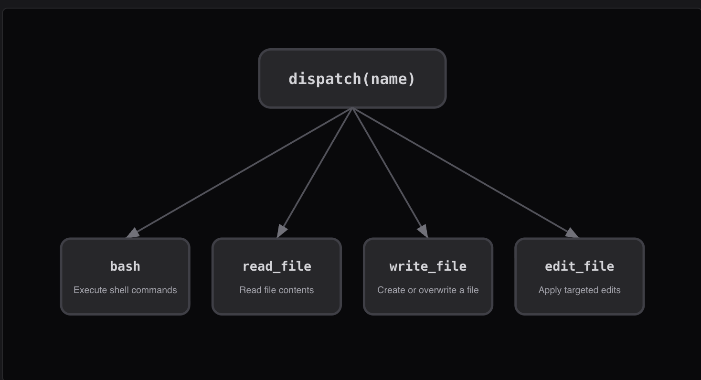

# 使用工具: Tool Use

<br>

---

<br>

> The loop stays the same; new tools register into the dispatch map


## 問題

只有 bash 時，所有操作都走 shell。 

`cat` 截斷不可預測，崩潰 bash 呼叫都是不受安全約束的面。

專用工具 (`read_file`, `write_file`) 可以在工具層級做路徑 sandbox。

關鍵洞察：加工具不需要重新循環。

## Design



<br>

## Source Code

### define tools
```py
# 防止路徑逃逸，涉及到路徑一律使用 safe_path() 
# ps: claude code 已經把這個功能移除了
def safe_path(p: str) -> Path:
    path = (WORKDIR / p).resolve()
    if not path.is_relative_to(WORKDIR):
        raise ValueError(f"Path escapes workspace: {p}")
    return path

def run_read(path: str, limit: int = None) -> str:
    text = safe_path(path).read_text()
    lines = text.splitlines()
    if limit and limit < len(lines):
        lines = lines[:limit]
    return "\n".join(lines)[:50000]
```

<br>

### dispatch map 將工具名稱對應到處理方法

```py
TOOL_HANDLERS = {
    "bash":       lambda **kw: run_bash(kw["command"]),
    "read_file":  lambda **kw: run_read(kw["path"], kw.get("limit")),
    "write_file": lambda **kw: run_write(kw["path"], kw["content"]),
    "edit_file":  lambda **kw: run_edit(kw["path"], kw["old_text"], kw["new_text"]),
}

SYSTEM = "這裡描述一下 TOOL 的 schema..."
```

<br>

### Agent Loop 中按名稱查找處理方法

```py
for block in response.content:

    if block.type == "tool_use":
        # 1. find tool.
        handler = TOOL_HANDLERS.get(block.name)

        # 2. using tool.
        output = handler(**block.input) if handler \
            else f"Unknown tool: {block.name}"

        # 3. append tool using result to context.
        results.append({
            "type": "tool_result",
            "tool_use_id": block.id,
            "content": output,
        })
```


<br>

---

<br>

[back](README.md) | [next](2-3.md)