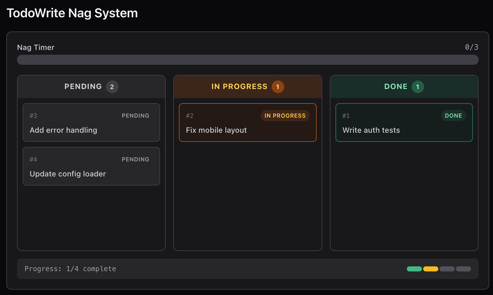

# 小步驟規劃: TodoWrite

<br>

---

<br>


> An agent without a plan drifts; list the steps first, then execute

## 問題

多步驟任務中, 模型會失去進度 -- 重複做過的事、跳步、離題。

context 越長越嚴重: 工具結果不斷填滿上下文, 系統提示的影響力逐漸被稀釋。一個 10 步重構可能做完 1-3 步就開始即興發揮, 因為 4-10 步已經被擠出注意力了。

## Design

```
+--------+      +-------+      +---------+
|  User  | ---> |  LLM  | ---> | Tools   |
| prompt |      |       |      | + todo  |
+--------+      +---+---+      +----+----+
                    ^                |
                    |   tool_result  |
                    +----------------+
                          |
              +-----------+-----------+
              | TodoManager state     |
              | [ ] task A            |
              | [>] task B  <- doing  |
              | [x] task C            |
              +-----------------------+
                          |
              if rounds_since_todo >= 3:
                inject <reminder> into tool_result

```



<br>

## Source Code

### TodoManager 儲存帶狀態的 tasks。同一時間只允許一個 `in_progress`。

```py
class TodoManager:

    def update(self, items: list) -> str:

        validated, in_progress_count = [], 0

        for item in items:

            status = item.get("status", "pending")

            if status == "in_progress": # 發現 task 是 in_progress
                in_progress_count += 1

            validated.append({"id": item["id"], "text": item["text"], "status": status})

        if in_progress_count > 1:
            raise ValueError("Only one task can be in_progress")

        self.items = validated
        return self.render()
```

<br>

### todo 工具和其他工具一样加入 dispatch map。

```py
TOOL_HANDLERS = {
    # ...base tools...
    "todo": lambda **kw: TODO.update(kw["items"]),
}
```

<br>

### nag reminder: 模型連續 3 輪以上不 call todo 時注入提醒 prompt。

```py

## ... during agent loop>

    if rounds_since_todo >= 3 and messages:
        last = messages[-1]
        if last["role"] == "user" and isinstance(last.get("content"), list):
            last["content"].insert(0, {
                "type": "text",
                "text": "<reminder>Update your todos.</reminder>",
            })

## ... during agent loop<
```

<br>

---

<br>

[back](README.md) | [next](2-4.md)