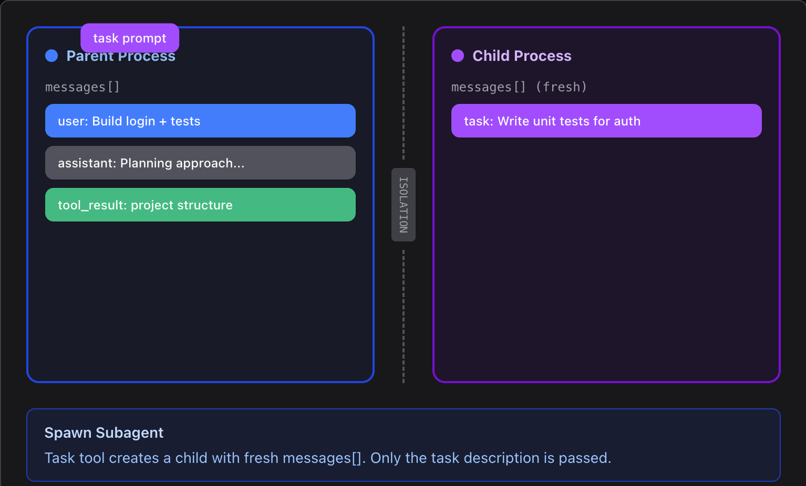
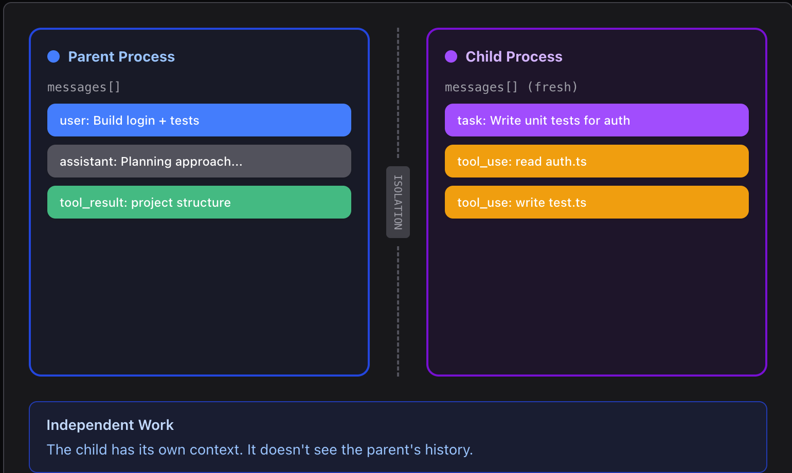
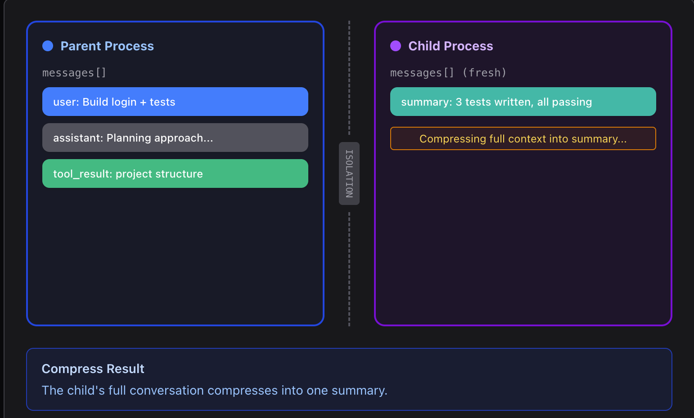
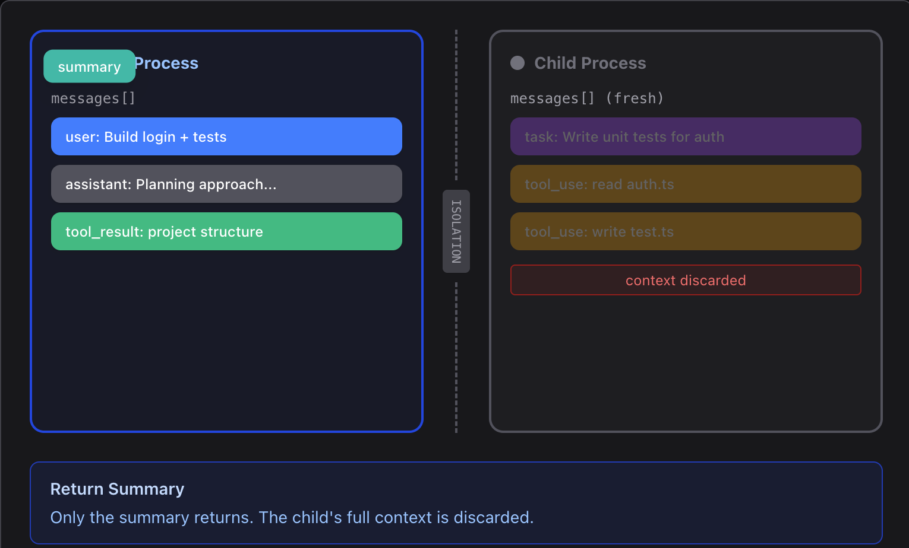

# 分身: Subagent

<br>

---

<br>


> Subagents use independent messages[], keeping the main conversation clean

## 問題

Agent 工作越久, messages(context) 越肥。

每次讀取檔案、跑指令的輸出都永久留在上下文。 "這個專案用什麼測試框架?" 可能要讀 5 個檔案, 但父 Agent 其實只想要回覆 user 一個字: "pytest"

<br>

## Design

1. 主 Agent 建立 subAgent 並自動建立 prompt:


2. subAgent 在獨立的 context 中執行任務:


3. subAgent 完成任務並回報 summary 給主 Agent


4. 主 Agent 得到節過後直接 discard subAgent


**可以看到主 Agent 的上下文始終保持少量且乾淨的內容。**

<br>

## Source Code

### 主 Agent 有一個 task 工具。 Subagent 擁有除 task 外的所有基礎工具 (禁止遞歸產生)。

```py
PARENT_TOOLS = CHILD_TOOLS + [
    {"name": "task",
     "description": "Spawn a subagent with fresh context.",
     "input_schema": {
         "type": "object",
         "properties": {"prompt": {"type": "string"}},
         "required": ["prompt"],
     }},
]
```

<br>

### Subagent 以 `messages=[]` 啟動, 運行自己的 Loop。只有最終文字傳回給主 Agent。

```py
def run_subagent(prompt: str) -> str:

    sub_messages = [{"role": "user", "content": prompt}]

    for _ in range(30):  # safety limit 30
        
        # 1. call LLM
        response = client.messages.create(
            model=MODEL, system=SUBAGENT_SYSTEM,
            messages=sub_messages,
            tools=CHILD_TOOLS, max_tokens=8000,
        )

        sub_messages.append({"role": "assistant", "content": response.content})

        if response.stop_reason != "tool_use": 
            break

        results = []
        for block in response.content:

            if block.type == "tool_use":

                handler = TOOL_HANDLERS.get(block.name)
                output = handler(**block.input)
                results.append({"type": "tool_result",
                    "tool_use_id": block.id,
                    "content": str(output)[:50000]})

        sub_messages.append({"role": "user", "content": results})
    return "".join(
        b.text for b in response.content if hasattr(b, "text")
    ) or "(no summary)"
```


Subagent 可能跑了 30+ 次工具調用, 但整個上下文直接丟掉。

主 Agent 收到的只是一段摘要文字, 作為普通 `tool_result` 返回。

<br>

---

<br>

[back](README.md) | [next](2-5.md)