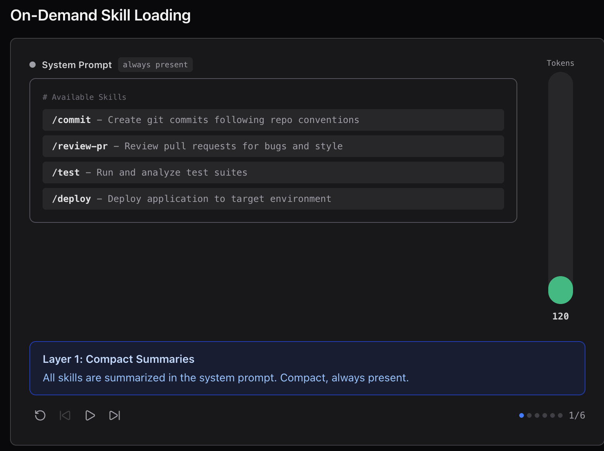
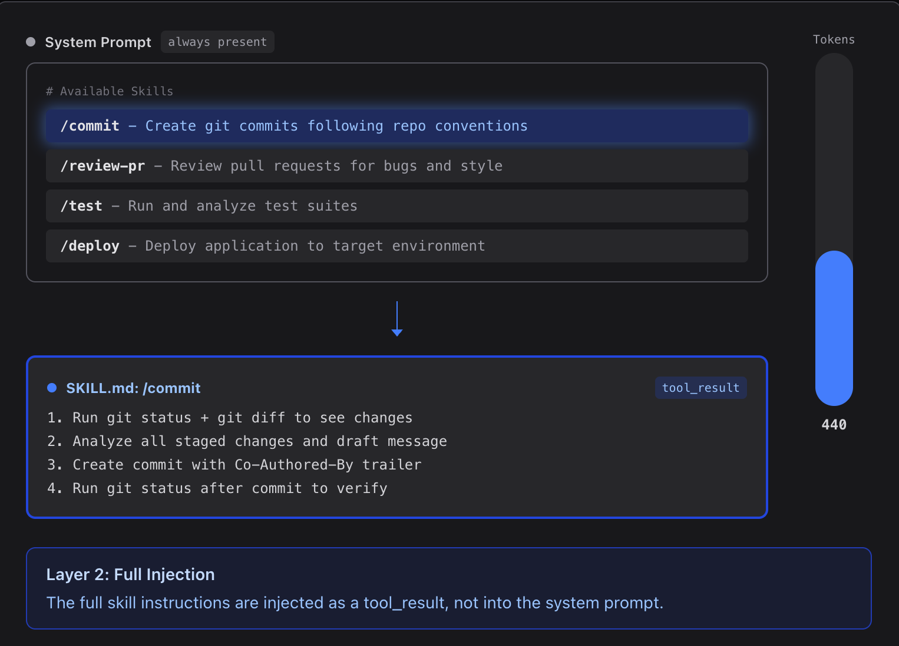
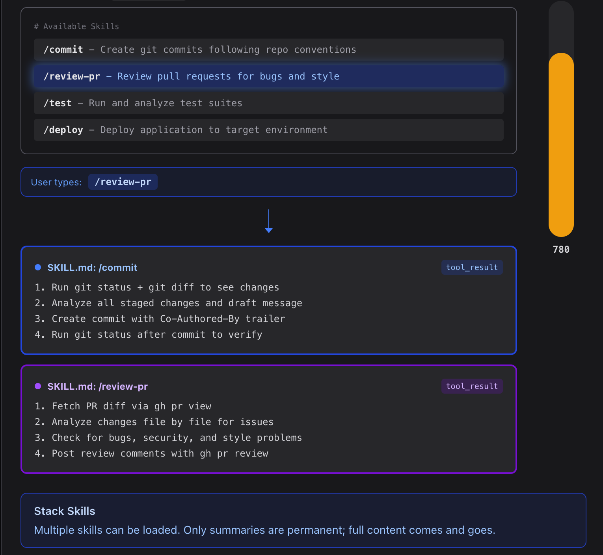

# 技能: Skills

<br>

---

<br>

> Inject knowledge via tool_result when needed, not upfront in the system prompt


## 問題

你希望 Agent 遵循特定領域的工作流程: 

git 約定、測試、code review。全塞進系統提示詞太浪費 -- 10 個 Skill, 每個 2000 token, 就是 20,000 token, 大部分跟當前任務毫無關係。

## Design

1. 初始化時只讀取 skills 列表＋簡介 (Layer-1)


2. 使用 skills 時載入全部描述 (Layer-2)


1. 同一個 context 讀取 skills 越多上下文越大:



<br>

## Source Code

### SkillLoader 遞歸掃描 SKILL.md 檔案, 以目錄名稱作為 Skill 識別。

```py
class SkillLoader:

    def __init__(self, skills_dir: Path):
        self.skills = {}
        for f in sorted(skills_dir.rglob("SKILL.md")):
            text = f.read_text()
            meta, body = self._parse_frontmatter(text)
            name = meta.get("name", f.parent.name)
            # 全部 load 到 local runtime 中
            self.skills[name] = {"meta": meta, "body": body}

    # 少量描述
    def get_descriptions(self) -> str:
        lines = []
        for name, skill in self.skills.items():
            desc = skill["meta"].get("description", "")
            lines.append(f"  - {name}: {desc}")
        return "\n".join(lines)

    # 取得完整內容
    def get_content(self, name: str) -> str:
        skill = self.skills.get(name)
        if not skill:
            return f"Error: Unknown skill '{name}'."
        return f"<skill name=\"{name}\">\n{skill['body']}\n</skill>"
```

### 把所有技能的基本描述放到系統提示詞裡

```py
# 系統提示詞
SYSTEM = f"""You are a coding agent at {WORKDIR}.
Skills available:
{SKILL_LOADER.get_descriptions()}""" 

# 更新 tools
TOOL_HANDLERS = {
    # ...base tools...
    "load_skill": lambda **kw: SKILL_LOADER.get_content(kw["name"]),
}
```

<br>

---

<br>

[back](README.md) | [next](2-6.md)