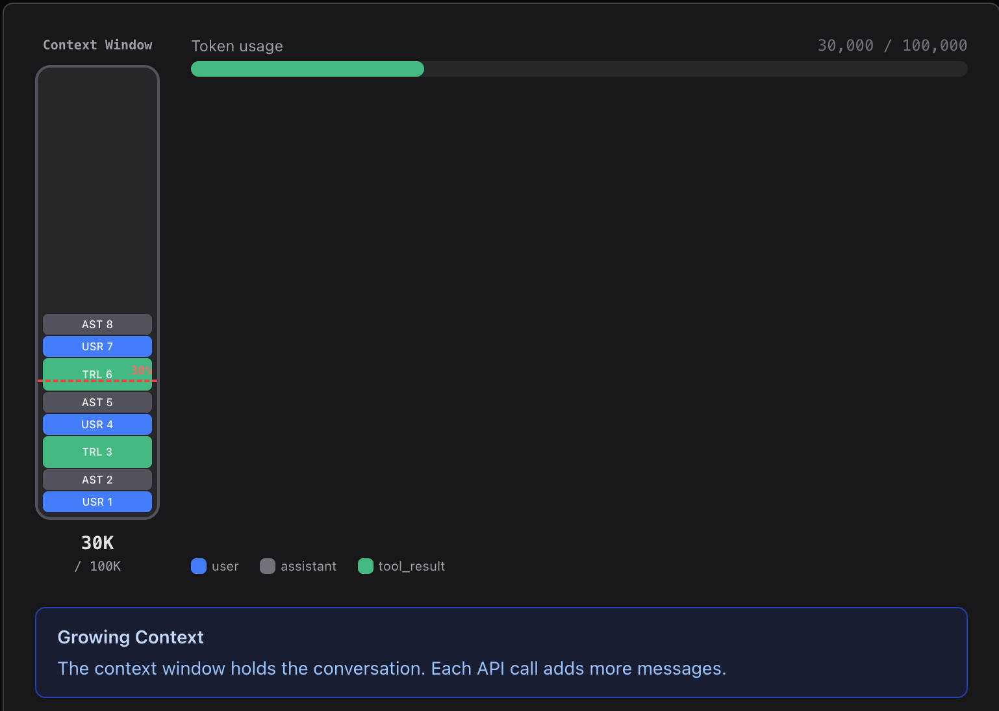
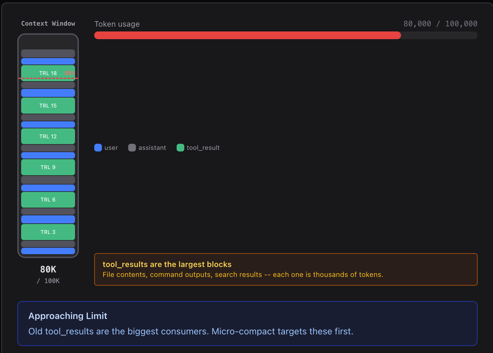
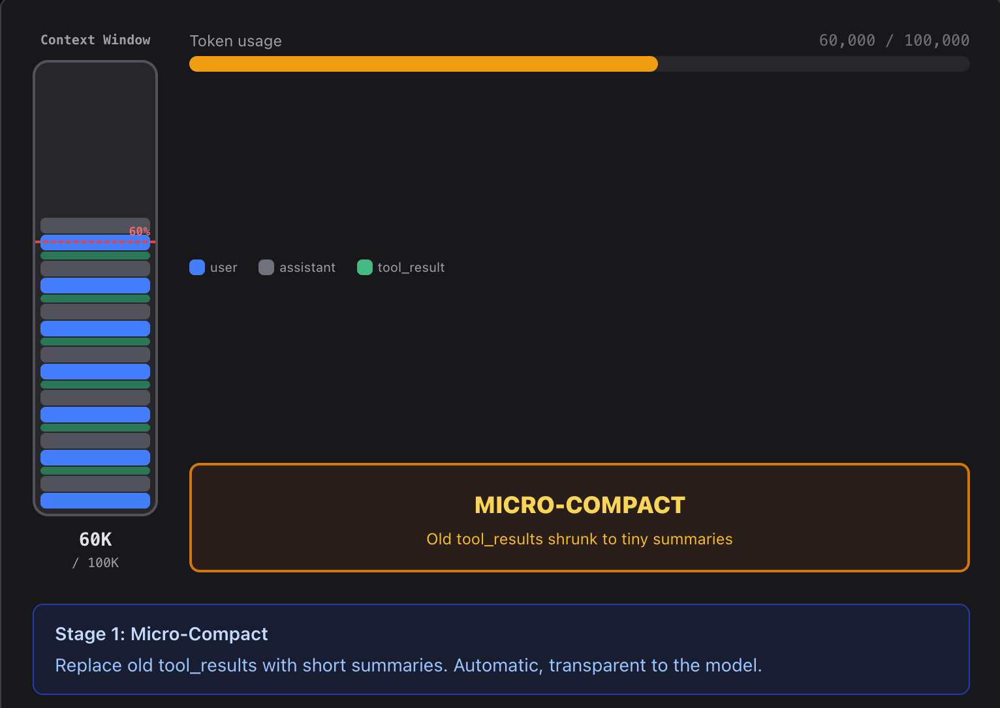
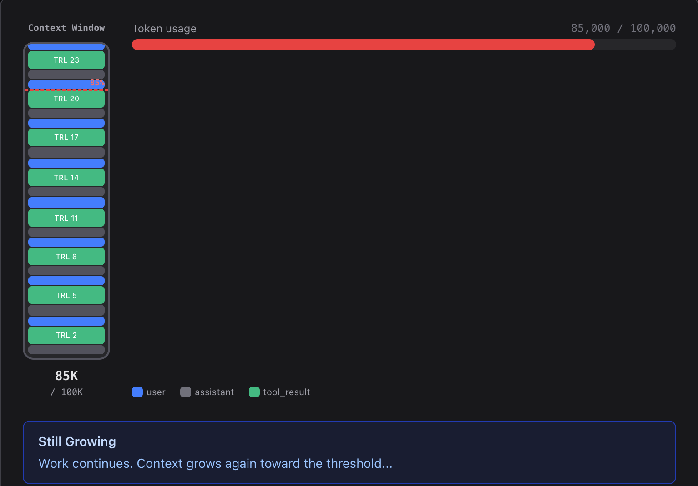
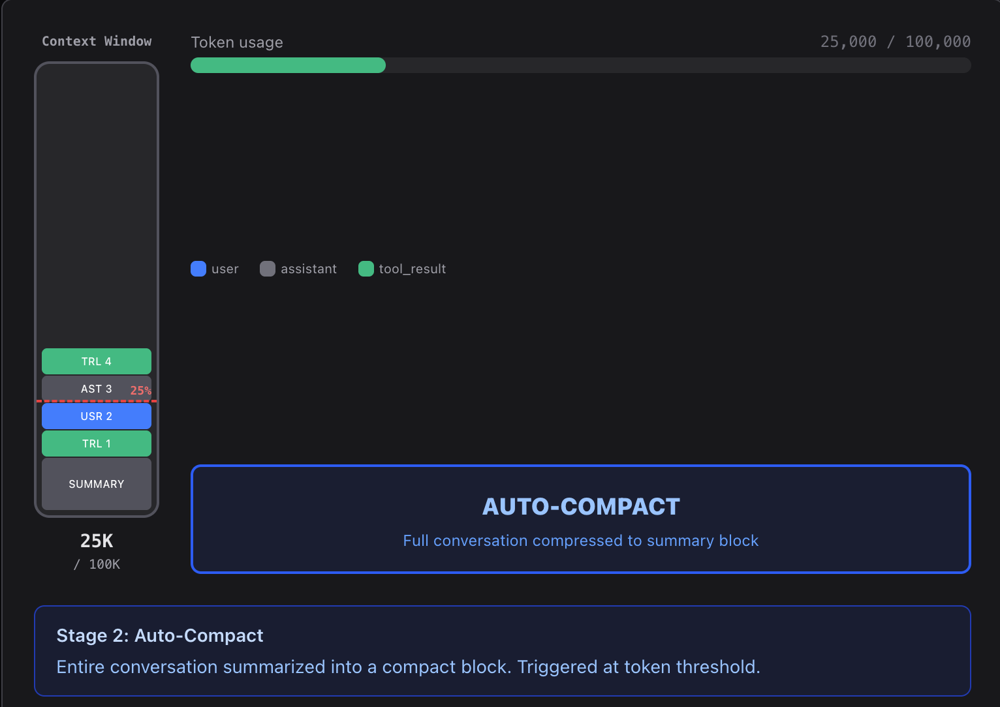

# Context 管理: `/clear`, `/compact` 

<br>

---

<br>

> Context will fill up; three-layer compression strategy enables infinite sessions

## 問題

上下文容量是有限的。

讀一個 1000 行的文件就吃掉 ~4000 token; 讀 30 個文件、跑 20 條指令, 輕鬆突破 100k token。不壓縮, Agent 根本沒辦法在大專案裡工作。

<br>

## Design


三層壓縮, 激進程度遞增:

1. 開始對話


1. 上下文膨脹到 80% 


1. 執行一次 micro-compact (壓縮工具調用結果細節)


1.繼續對話直到再次達到 80%


1. 觸發 auto-compact (整體做一次 summary)


<br>

## Source Code

### 第一層壓縮 -- `micro_compact`: 每次 LLM 呼叫前, 將舊的 tool result 替換為佔位符。

```py
def micro_compact(messages: list) -> list:
    tool_results = []

    for i, msg in enumerate(messages):
        if msg["role"] == "user" and isinstance(msg.get("content"), list):
            for j, part in enumerate(msg["content"]):
                if isinstance(part, dict) and part.get("type") == "tool_result":
                    tool_results.append((i, j, part))

    if len(tool_results) <= KEEP_RECENT:
        return messages

    for _, _, part in tool_results[:-KEEP_RECENT]:
        if len(part.get("content", "")) > 100:
            part["content"] = f"[Previous: used {tool_name}]"

    return messages
```

<br>

### 第二層壓縮 -- `auto_compact`: token 超過閾值時, 儲存完整對話到硬碟, 讓 LLM 做 summary。

```py
def auto_compact(messages: list) -> list:
    # Save transcript for recovery
    transcript_path = TRANSCRIPT_DIR / f"transcript_{int(time.time())}.jsonl"
    with open(transcript_path, "w") as f:
        for msg in messages:
            f.write(json.dumps(msg, default=str) + "\n")

    # LLM summarizes
    response = client.messages.create(
        model=MODEL,
        messages=[{"role": "user", "content":
            "Summarize this conversation for continuity..."
            + json.dumps(messages, default=str)[:80000]}],
        max_tokens=2000,
    )

    # return summary
    return [
        {"role": "user", "content": f"[Compressed]\n\n{response.content[0].text}"},
    ]
```

<br>

### 第三層壓縮 -- manual `/compact`: compact 工具按需觸發同樣的摘要機制。

本質上就是 `auto_compact` 只不過這個是人為觸發的。

<br>

### 整合三層壓縮

```py
def agent_loop(messages: list):
    while True: # Agent Loop..

        micro_compact(messages)                        # Layer 1 壓縮工具調用細節

        if estimate_tokens(messages) > THRESHOLD:
            messages[:] = auto_compact(messages)       # Layer 2 context 超過閾值自動壓縮一次
        response = client.messages.create(...)

        # ... tool execution ...
        if manual_compact:
            messages[:] = auto_compact(messages)       # Layer 3 user 手動輸入 /compact 執行壓縮
```

<br>

---

<br>

[back](README.md) | [next](2-7.md)