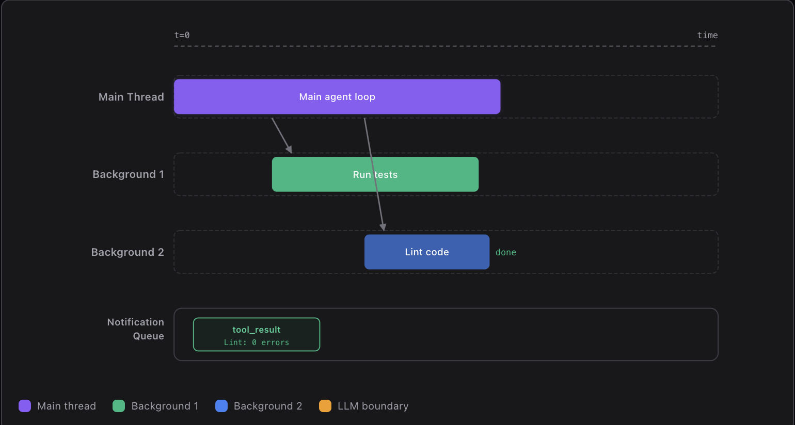
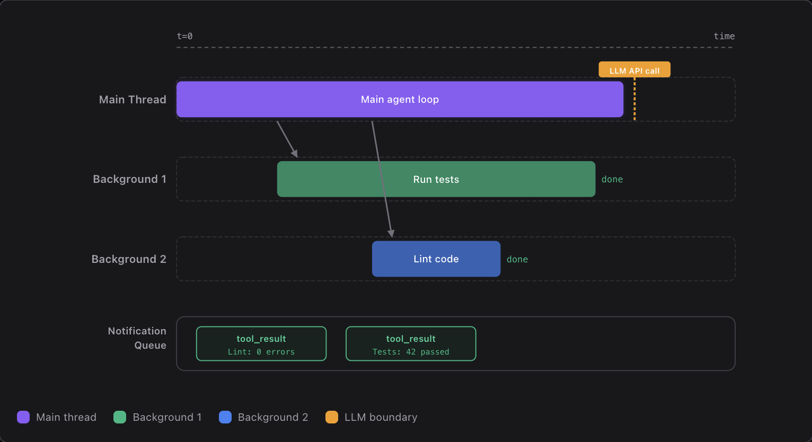
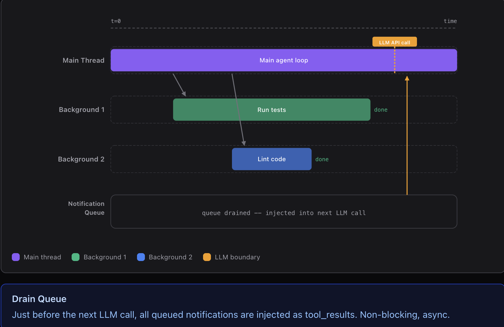

# 並行任務: Background Tasks

<br>

---

<br>

> Run slow operations in the background; the agent keeps thinking ahead

## 問題

有些指令要跑好幾分鐘: `npm install`、`pytest`、`docker build`。

阻塞式循環下模型只能乾等。使用者說 "裝套件, 順便幫我建立設定檔", Agent 卻只能一個一個來。


<br>

## Design

1. 主 Agent 並行兩個任務，同時自己也在做自己的工作:


2. 兩個並行背景運行的任務都完成了，且完成任務的通知都發到 `Notification Queue` 中。


3. 主 Agent 在下一次循環中順便從 `Notification Queue` 得知兩個背景任務已完成，接續執行餘下任務。


<br>

## Source Code

### BackgroundManage: thread safe 任務結果通知 queue

```py
class BackgroundManager:
    def __init__(self):
        self.tasks = {}
        self._notification_queue = []
        self._lock = threading.Lock()
```

<br>

### 子任務完成後, 結果進入 `Notification Queue`。

```py
def _execute(self, task_id, command):
    try:
        r = subprocess.run(command, shell=True, cwd=WORKDIR,
            capture_output=True, text=True, timeout=300)
        output = (r.stdout + r.stderr).strip()[:50000]

    except subprocess.TimeoutExpired:
        output = "Error: Timeout (300s)"

    with self._lock:
        # 入 queue
        self._notification_queue.append({
            "task_id": task_id, "result": output[:500]})
```

<br>

### 每次調用 LLM 服務前清空 `Notification Queue`。

```py
def agent_loop(messages: list):

    while True: # LOOP !!!!!!!!

        notifs = BG.drain_notifications()

        if notifs:
            notif_text = "\n".join(
                f"[bg:{n['task_id']}] {n['result']}" for n in notifs)

            # 把已完成的非同步任務放入 context
            messages.append({"role": "user",
                "content": f"<background-results>\n{notif_text}\n"
                           f"</background-results>"})

        # 調用 LLM 服務，順便告知哪些背景任務已完成。
        response = client.messages.create(...)
```

<br>

---

<br>

[back](README.md)